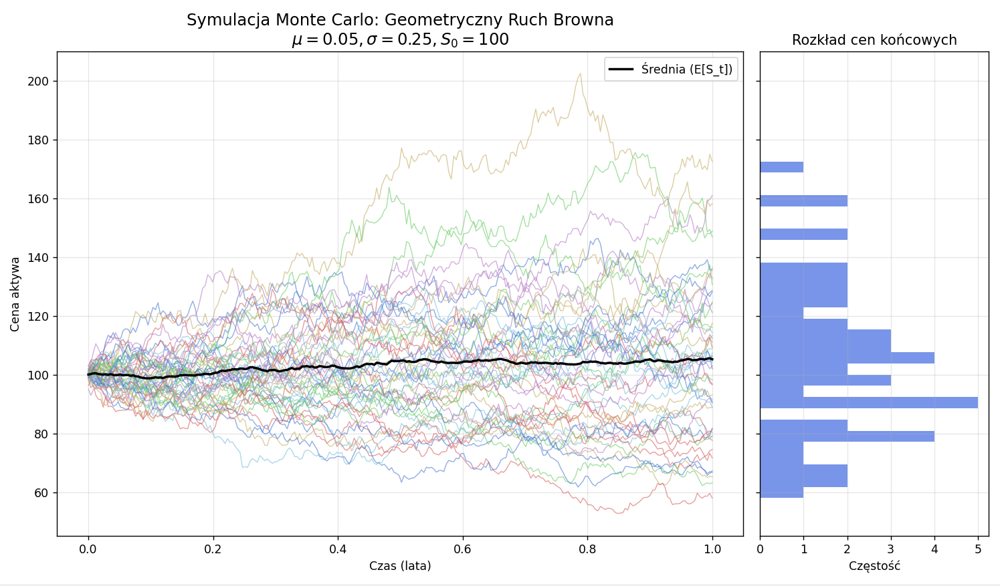

# Stochastic Simulation: Geometric Brownian Motion

## Cel projektu
Implementacja modelu **Geometrycznego Ruchu Browna (GBM)** służącego do modelowania cen aktywów finansowych. Projekt łączy teorię procesów stochastycznych z wydajnymi obliczeniami w środowisku Python.

## Technologie
* **Python / NumPy**: Pełna wektoryzacja obliczeń macierzowych (eliminacja pętli `for`).
* **Matplotlib**: Zaawansowana wizualizacja ścieżek cenowych oraz rozkładów brzegowych.

## Model Matematyczny
Symulacja opiera się na rozwiązaniu stochastycznego równania różniczkowego (SDE):
$$dS_t = \mu S_t dt + \sigma S_t dW_t$$

W projekcie wykorzystano rozwiązanie w formie zamkniętej:
$$S_t = S_0 \exp\left(\left(\mu - \frac{1}{2}\sigma^2\right)t + \sigma W_t\right)$$

## Kluczowe wnioski (Insights)
* **Rozkład końcowy**: Symulacje potwierdzają, że ceny końcowe $S_T$ podlegają **rozkładowi log-normalnemu**, co wynika z addytywności logarytmicznych stóp zwrotu.
* **Wpływ zmienności**: Wzrost parametru $\sigma$ zwiększa dyspersję wyników i przesuwa medianę rozkładu poniżej wartości oczekiwanej (efekt członu $-\frac{1}{2}\sigma^2$).
* **Zbieżność**: Średnia empiryczna z symulacji Monte Carlo wykazuje silną zbieżność z teoretyczną wartością oczekiwaną $E[S_t] = S_0 e^{\mu t}$, co weryfikuje poprawność algorytmu.
* **Efektywność**: Zastosowanie wektoryzacji w NumPy pozwala na generowanie $10^5$ ścieżek w czasie rzeczywistym.

## Wizualizacja

